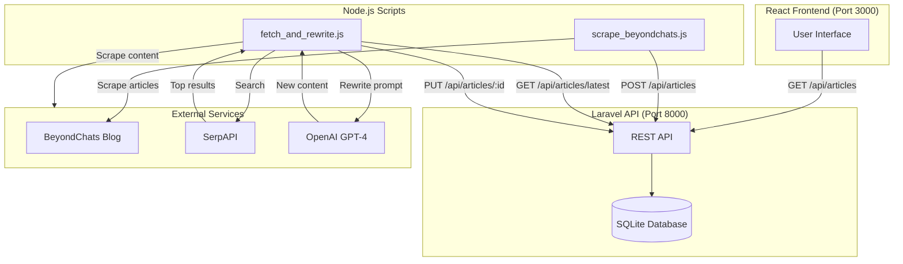

# BeyondChats Assignment — Full Stack Implementation

This repository contains a complete implementation of the BeyondChats take-home assignment, featuring a Laravel backend API, Node.js automation scripts, and a React frontend.

## 🚀 Quick Start

**📖 For detailed setup instructions, see [SETUP.md](SETUP.md)**  
**⚡ For quick commands and reference, see [QUICK_REFERENCE.md](QUICK_REFERENCE.md)**

### Prerequisites
- PHP 8.1+ & Composer
- Node.js 18+
- OpenAI API Key
- SerpAPI Key (free tier available)

### Running the Project

**Terminal 1 - Laravel Backend (Port 8000):**
```powershell
cd backend
composer install
cp .env.example .env
php artisan key:generate
# Create SQLite database: New-Item -Path database\database.sqlite -ItemType File
php artisan migrate
php artisan serve
```

**Terminal 2 - Frontend (Port 3000):**
```powershell
cd frontend
npm install
npm run dev
```

**Terminal 3 - Scrape & Rewrite:**
```powershell
cd node-scripts
npm install
# Create .env with API keys (see SETUP.md)
npm run scrape    # Scrape BeyondChats articles
npm run run       # AI rewrite with OpenAI
```

Visit: http://localhost:3000

## 📁 Project Structure

```
BeyondChatAssessment/
├── backend/           # Laravel 10+ API with Article CRUD
├── node-scripts/      # Scraper + AI rewriter scripts
├── frontend/          # React + Vite UI
├── SETUP.md          # Complete setup guide
└── README.md         # This file
```

## ✨ What This Does

### Phase 1: Article Scraping & API
- Scrapes 5 oldest articles from BeyondChats blog
- Laravel REST API with full CRUD operations
- SQLite database for easy setup

### Phase 2: AI Article Rewriter
- Searches Google for similar articles (via SerpAPI)
- Scrapes top 2 reference articles
- Uses OpenAI GPT-4 to rewrite with similar formatting
- Adds references at bottom

### Phase 3: Frontend Display
- Responsive React UI
- Side-by-side view of original vs updated content
- Real-time API integration


## 🏗️ Architecture Diagram



## 📚 API Endpoints

| Method | Endpoint | Description |
|--------|----------|-------------|
| GET | `/api/articles` | List all articles (paginated) |
| GET | `/api/articles/latest` | Get most recent article |
| GET | `/api/articles/{id}` | Get single article |
| POST | `/api/articles` | Create new article |
| PUT | `/api/articles/{id}` | Update article |
| DELETE | `/api/articles/{id}` | Delete article |

## 🛠️ Tech Stack

**Backend:**
- Laravel 10+
- PHP 8.1+
- SQLite

**Scripts:**
- Node.js 18+
- Axios (HTTP client)
- Cheerio (Web scraping)
- OpenAI API
- SerpAPI

**Frontend:**
- React 18
- Vite
- Axios

## 📝 Implementation Notes

This is a scaffold to demonstrate approach and working code. Key features:

- **Phase 1:** Web scraping with fallback content extraction
- **Phase 2:** AI-powered content rewriting with reference citations
- **Phase 3:** Clean, responsive UI for content comparison

See [SETUP.md](SETUP.md) for detailed instructions.

## 🌐 Live Demo

- **Frontend**: https://beyondchat-alpha.vercel.app/
- **Backend API**: https://beyondchat-9dau.onrender.com/api/articles
- **GitHub Repository**: https://github.com/Mahendrakumar19/beyondchat